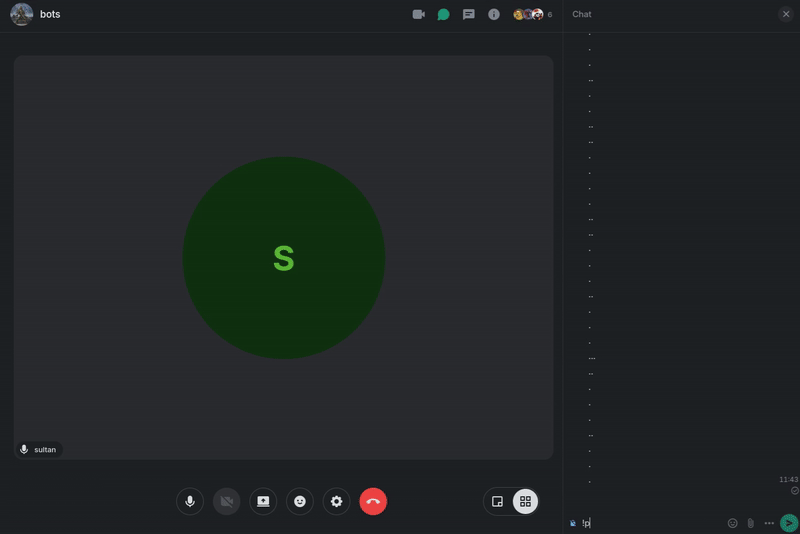
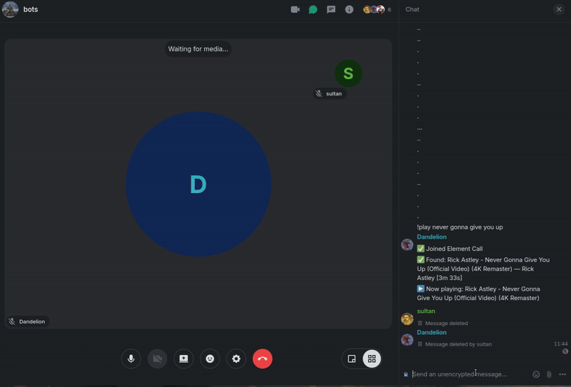
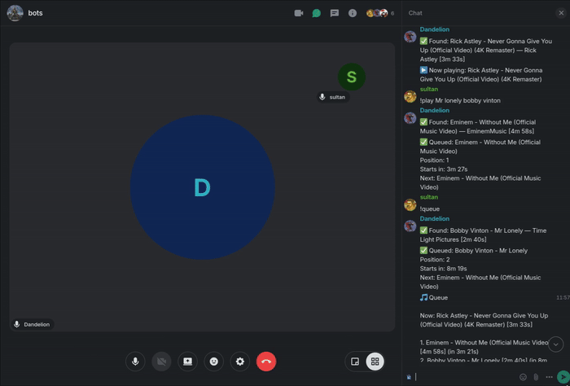

# Matrix Element Call MusicBot

Discord-style music bot UX for Matrix: chat commands (`!play`, `!queue`, `!skip`, etc.) plus real playback in Element Call.

## Features

- Discord-style chat command workflow in Matrix rooms
- Joins Element Call and plays audio directly in call
- URL or search-based playback with queue and ETA
- Saved queue presets (`save`, `load`, `rename`, `delete`)
- Playback history and now-playing visibility
- Audio controls (volume, fade-in, normalization)
- Built-in diagnostics and runtime status commands
- Quiet-mode messaging defaults for less chat noise during playback
- Fast search defaults for quicker `!play` query resolution

## Performance Defaults

- `ui.quiet_mode = true` by default (suppresses non-critical chatter)
- `audio.search_mode = "fast"` by default (faster query resolution)
- `audio.stream_first_idle = true` by default (instant playback start when idle)

## Important

> [!WARNING]
> This bot does **not support encrypted calls yet**.
> If your room/call requires end-to-end encrypted call media, playback will not work yet.

## Current Limitations

- No encrypted call media support yet
- Single active playback session at a time (no sharding/multi-room playback yet)

## Troubleshooting

### `UnsupportedStickyEventsEndpointError` when joining call

If you see:

- `Membership manager error: ... UnsupportedStickyEventsEndpointError: Server does not support the sticky events`

your homeserver does not support sticky events yet. The worker will fall back and post:

- `Server lacks sticky events; fell back to legacy compatibility mode. Require PL50 (Moderator).`

What this means:

- PL50 is not always required.
- If your homeserver supports sticky events (`matrix2`/`matrix2_auto`), PL50 is typically not needed.
- On legacy mode, normal rooms may require PL50, while Video rooms can work without PL50.

How to force compatibility mode manually:

```toml
[worker]
membership_mode = "legacy"
```

Long-term fix:

- Upgrade your homeserver/call stack to support MatrixRTC sticky events, then use `matrix2_auto`.

## Roadmap (Not Concrete)

- Public hosted bot for other communities
- Add encrypted call support
- Add sharding/multi-room playback support so music can run in multiple rooms at once
- Playlist support

## Contributing

Pull requests are appreciated. If you want to help, open a PR.

## Contact

- `contact@alburaqsultan.com`

## Demo

<p align="center">
  
</p>

<p align="center">
  
</p>

<p align="center">
  
</p>


## Commands

### Playback

- `!help` (`!h`) - show this help
- `!join` (`!j`) - join Element Call in this room
- `!leave` (`!lv`) - leave current Element Call
- `!play` (`!p`) `<url-or-query>` - add track and auto-join call if needed
- `!queue` (`!q`) - show queue with ETA
- `!nowplaying` (`!np`) - show current track
- `!skip` (`!s`) - skip current track
- `!stop` (`!x`) - stop playback and clear queue
- `!loop` (`!lp`) - toggle loop mode
- `!history` (`!hist`) - show recent playback history

### Saved Queues

- `!save` (`!sv`) `<name> [--force]` - save current+upcoming queue
- `!load` (`!ld`) `<name>` - load a saved queue
- `!queues` (`!qs`) - list saved queues
- `!deletequeue` (`!dq`) `<name>` - delete a saved queue
- `!renamequeue` (`!rq`) `<old> <new>` - rename a saved queue

### Audio & Info

- `!audio` (`!a`) - show current audio settings
- `!normalize` (`!norm`) `on|off` - toggle normalization
- `!fadein` (`!fi`) `<ms>` - set fade-in (`0-5000`)
- `!volume` (`!v`) `<0-200>` - set playback volume percent
- `!status` (`!st`) - show bot status
- `!diag` (`!d`) - show diagnostics
- `!config` (`!cfg`) - show active config
- `!defaults` (`!df`) - show default config values

## Docker (Prebuilt Image, Recommended)

Use this for prebuilt images. 

### Linux

```bash
mkdir -p matrix-musicbot/config
cd matrix-musicbot

# Prebuilt image on GHCR
cat > docker-compose.yml <<'YAML'
services:
  musicbot:
    image: ghcr.io/sultanalburaq/matrix-element-call-musicbot:latest
    container_name: musicbot
    restart: unless-stopped
    environment:
      - CONFIG_FILE=/app/config/config.toml
    volumes:
      - ./config:/app/config:ro
      - musicbot_logs:/app/logs
      - musicbot_data:/app/data
      - musicbot_cache:/tmp/musicbot_audio

volumes:
  musicbot_logs:
  musicbot_data:
  musicbot_cache:
YAML

# Create config file
cp /path/to/config/config.example.toml config/config.toml
# Edit config/config.toml and set matrix.homeserver, matrix.user_id, matrix.access_token

docker compose up -d
```

### Windows (PowerShell)

```powershell
New-Item -ItemType Directory -Path matrix-musicbot\config -Force | Out-Null
Set-Location matrix-musicbot

@"
services:
  musicbot:
    image: ghcr.io/sultanalburaq/matrix-element-call-musicbot:latest
    container_name: musicbot
    restart: unless-stopped
    environment:
      - CONFIG_FILE=/app/config/config.toml
    volumes:
      - ./config:/app/config:ro
      - musicbot_logs:/app/logs
      - musicbot_data:/app/data
      - musicbot_cache:/tmp/musicbot_audio

volumes:
  musicbot_logs:
  musicbot_data:
  musicbot_cache:
"@ | Set-Content docker-compose.yml

# Copy /path/to/config/config.example.toml to .\config\config.toml
# Edit .\config\config.toml and set matrix.homeserver, matrix.user_id, matrix.access_token

docker compose up -d
```

## Docker (Build It Yourself From Release)

Use this when you want to download source release archives and build locally.

### Linux

```bash
# 1) Download and extract release source
# 2) Enter extracted folder
cd musicbot

mkdir -p config
cp config/config.example.toml config/config.toml
# Edit config/config.toml

docker compose up -d --build
```

### Windows (PowerShell)

```powershell
# 1) Download and extract release source
# 2) Enter extracted folder
Set-Location .\musicbot

New-Item -ItemType Directory -Path .\config -Force | Out-Null
Copy-Item .\config\config.example.toml .\config\config.toml
# Edit .\config\config.toml

docker compose up -d --build
```

## Run Without Docker (Raw)

Use this only if you want to run directly on the host.

### Linux

```bash
python3 -m venv venv
source venv/bin/activate

pip install -r requirements.txt
npm ci --prefix call_worker

cp config/config.example.toml config.toml
# Edit config.toml

python3 main.py
```

Requires: Python 3.11+, Node.js 22+, ffmpeg, yt-dlp.

### Windows (PowerShell)

```powershell
py -3 -m venv venv
.\venv\Scripts\Activate.ps1

pip install -r requirements.txt
npm ci --prefix call_worker

Copy-Item .\config\config.example.toml .\config.toml
# Edit .\config.toml

python .\main.py
```

Requires: Python 3.11+, Node.js 22+, ffmpeg, yt-dlp (available in PATH).

## Basic Verification

After start, check:

```bash
docker compose ps
docker logs --tail=100 musicbot
```

Then in Matrix room:

- `!help`
- `!join`
- `!play never gonna give you up`
